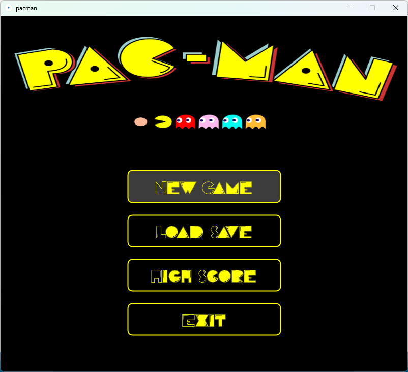

# Pacman
 
## Présentation

Ceci est une version modifiée d'un projet réalisé en binôme durant ma deuxième année de licence informatique. Le projet consistait à recréer de toute pièce le jeu Pacman en l'espace de deux semaines uniquement. 

Dans ce jeu il vous est possible de naviguer librement entre les menus et jouer uniquement en utilisant les flèches directionnelles du clavier. Il vous est aussi possible de sauvegarder et charger votre progression. Vous pourrez aussi consulter la liste des scores les plus élevés à tout moment depuis le menu principal. Cette liste peut évoluer en fonction de vos parties si vous arrivez à finir le niveau avec un score supérieur à au moins l'un des cinq scores inscrits sur la liste. Vous pouvez aussi choisir de changer le niveau sur lequel vous jouez en modifiant le fichier txt dans lequel est contenu le niveau.

En ce qui concerne le jeu en lui-même, le labyrinthe, le gameplay ainsi que les sprites des personnages ont été codés de manière à rester fidèle au jeu de base. Enfin tout comme dans le Pacman originel les fantômes peuvent être dans différents états. En fonction de l'état dans lequel ils se trouvent, les fantômes vont agir différemment : 
- Spawn : ils chercheront à sortir de la zone de départ
- Chase : ils traqueront pacman et lui feront perdre une vie s'ils le touchent. Dans ce mode les quatre fantômes adopteront une stratégie différente pour tenter de coincer pacman.
- Fear : ils peuvent être mangés par pacman
- Eat : ils cherchent à rentrer dans leur zone de départ

## Résultats

Dans cette section vous retrouverez différentes captures d'écran montrant le jeu en lui-même. Pour mieux vous rendre compte de comment fonctionne le jeu, je vous conseille de le tester par vous-même.

| Main Menu | High Scores  |
| - | - |
|  |  |

| Game Play | Pause Menu |
| - | - |
|  |  |